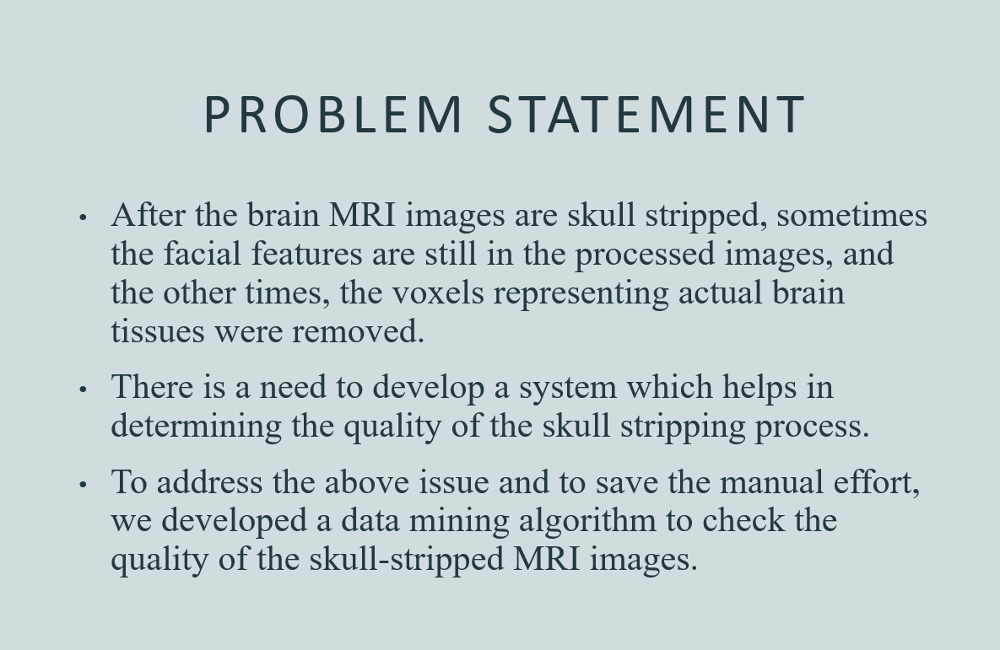
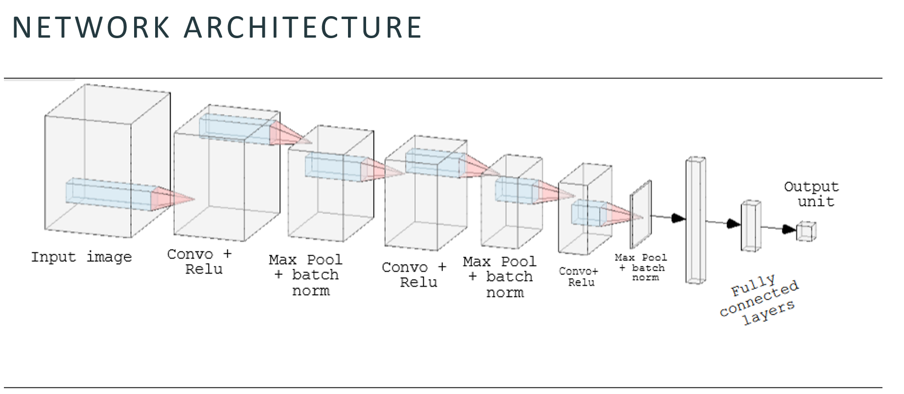
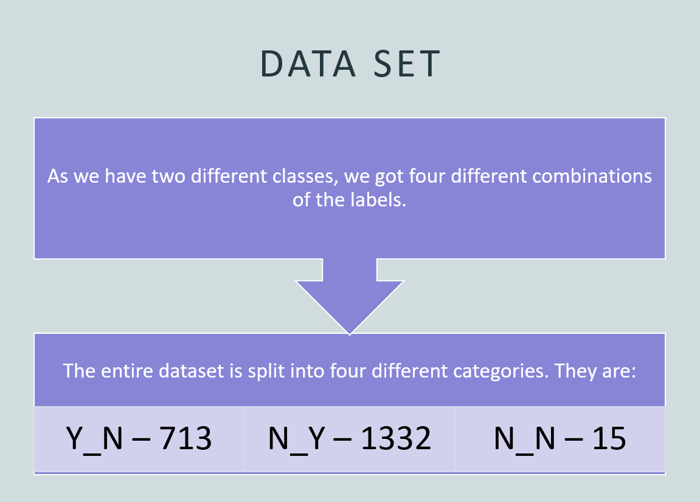
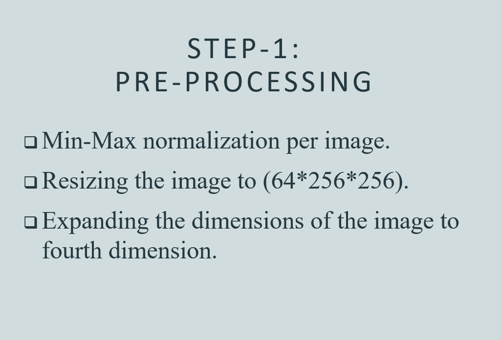
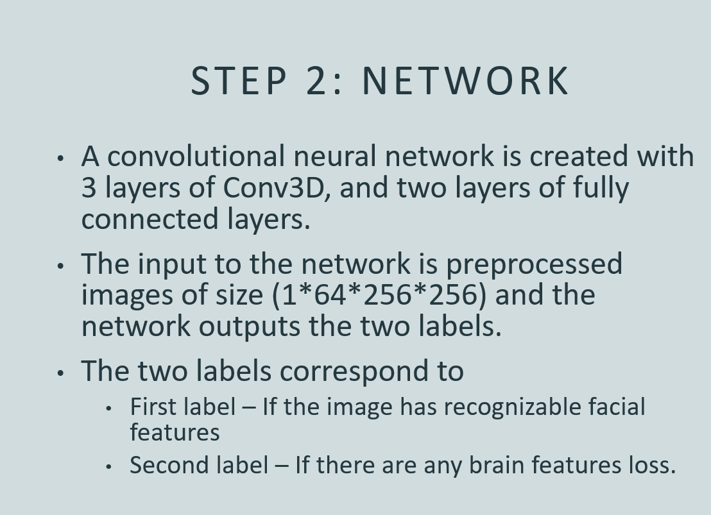
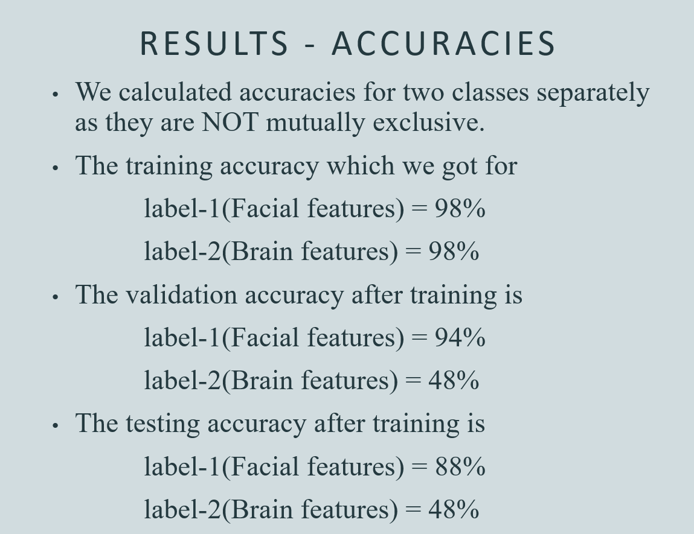
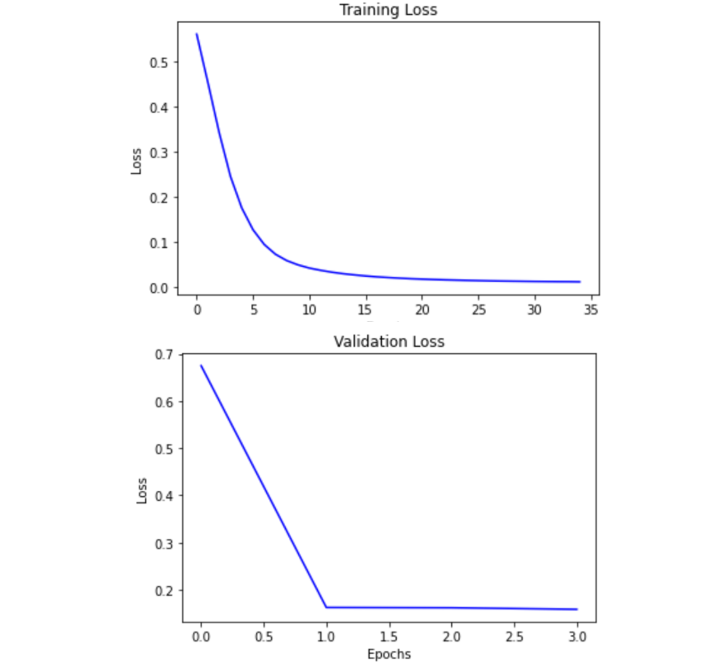

# Quality Evaluation of Skull Stripped Brain MRI Images

This project focuses on the quality evaluation of skull stripped brain MRI (Magnetic Resonance Imaging) images. Skull stripping is the process of removing the image voxels representing the skull structure and facial features from raw 3D MRI images to ensure compliance with HIPAA (Health Insurance Portability and Accountability Act) regulations. However, the accuracy of existing skull stripping algorithms varies, and manual inspection of the segmentation results is often required to ensure quality.

To address this issue, the authors propose a deep neural network algorithm based on 3D Convolutional Neural Networks (CNN) to evaluate the quality of skull stripped MRI images. CNNs are well-suited for image processing tasks and can provide accurate evaluations of the skull stripping process with minimal manual intervention.

The project utilizes a dataset of brain MRI images stored in the Neuroimaging Informatics Technology Initiative (NIFTI) format. The dataset includes images with different categories, such as images with recognizable facial features and images with brain feature loss. These categories are used to train, validate, and test the deep neural network model.

Before feeding the images into the network, pre-processing steps are applied. These include min-max normalization to bring pixel intensities within the range of 0-1, resizing the images to a consistent shape, and expanding the image dimensions to account for the 3D nature of MRI scans.

The network architecture consists of three 3D convolutional layers and three fully connected layers. Batch normalization is applied after each convolutional layer to improve training efficiency and overall performance. The activation function used is ReLU, and the pooling method employed is max pooling. The network is trained using sigmoid cross-entropy loss, which allows for independent prediction of the two labels related to recognizable facial features and brain feature loss.

The software used for this project is Python with the PyTorch deep learning framework. Additional libraries such as nibabel and torchsummary are utilized for reading input images and displaying metrics in a tabular format, respectively.

 

 

Several hyperparameters are set for the model, including the learning rate, batch size, number of epochs, optimizer (ADAM), and threshold value for determining class labels.

The results of the project demonstrate the effectiveness of the proposed deep neural network model for evaluating the quality of skull stripped MRI images. The accuracy of the model is assessed using test accuracy metrics, and the performance is found to be satisfactory.

Overall, this project presents a novel approach to streamline the evaluation of skull stripping processes in brain MRI images, reducing the need for manual inspection and providing accurate assessments of image quality.

How to run the code?
Step 1: Download the dataset from the link provided in the Dataset section. The dataset folder will be named as BSE_BET_DATA. The folder BSE_BET_DATA contains a subfolder called files and a labels.csv.
Step 2: Download the Quality_Evalution_Model.ipynb and place inside the folder BSE_BET_DATA.
Step 3: Execute each cell of the Quality_Evalution_Model.ipynb file. The 3D convolutional model will be build and will be trained for 35 epcohs. After the model is trained, it will be saved inside a folder named Model. (Note: Make sure to create a folder called Model to save the trained model). In later steps the saved model is loaded and evaluated using test dataset.
At the end, the model accuracies(ie.e., train, validation and test accuracies) are also saved and loaded to plot the accuracy vs epoch graph.

Contributors
Lakshmi Gayathri
Tejaswine Kantu
